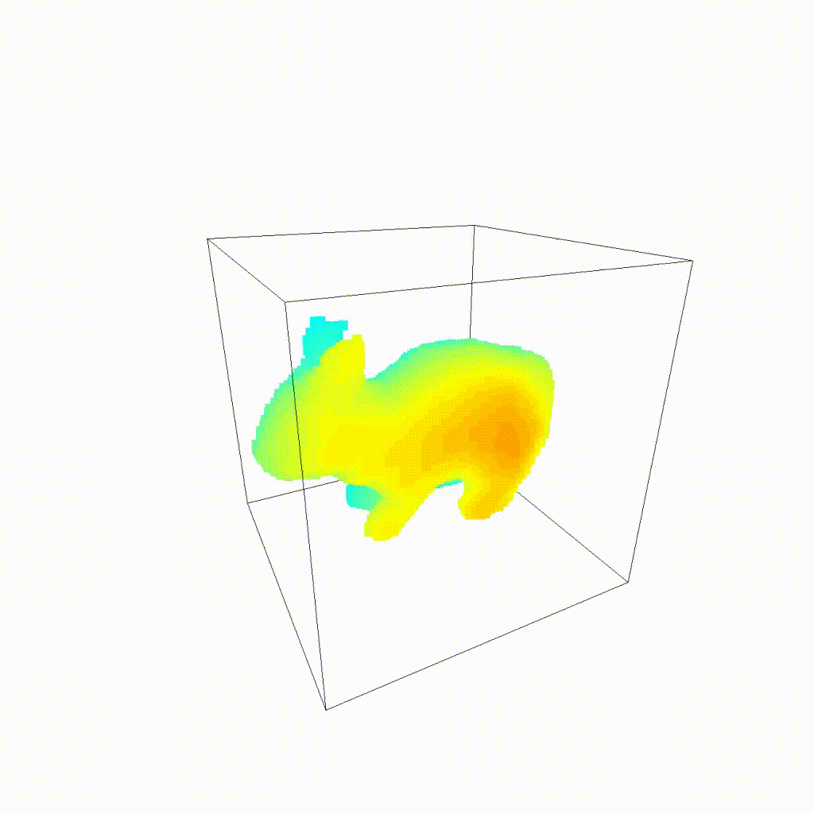
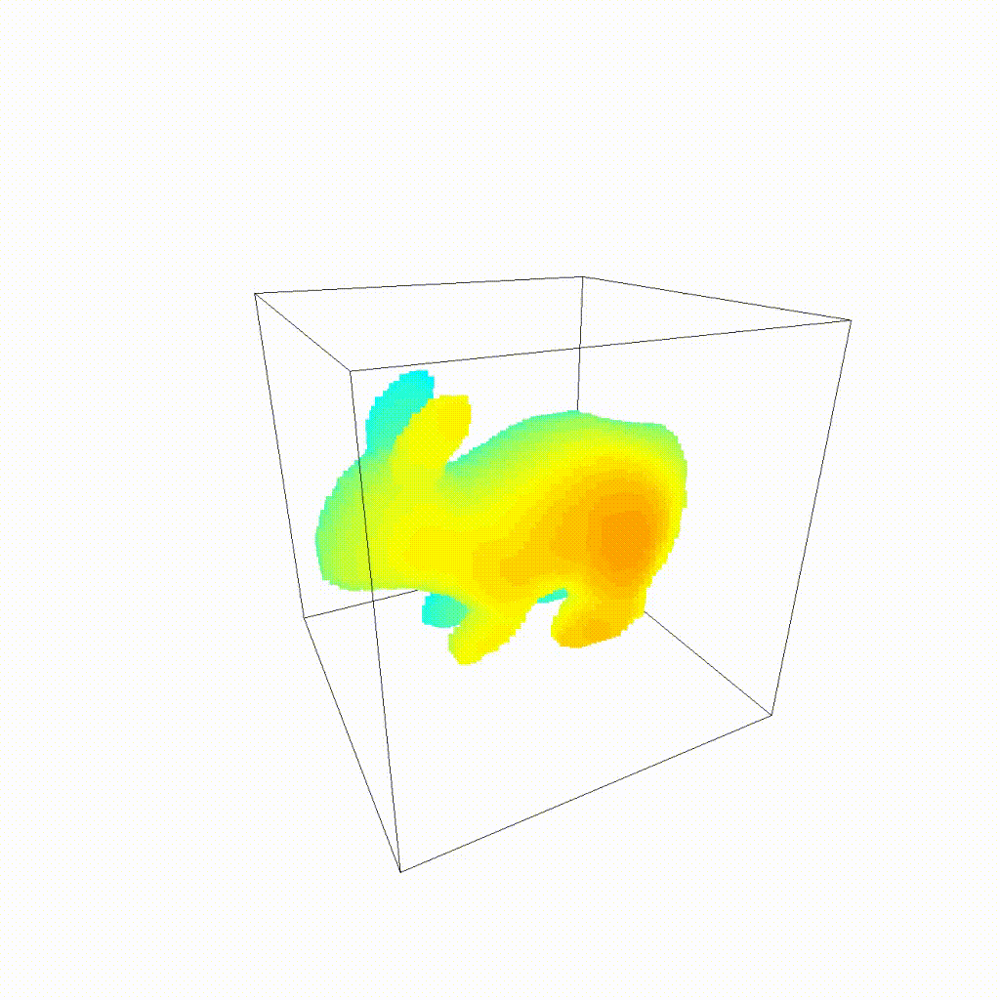

# Lipschitz MLP 

This project was done for the _Geometric Data Analysis_ course of the MVA Master (at ENS Paris-Saclay). I analyzed the paper **_Learning Smooth Neural Functions via Lipschitz Regularization_**, Liu et al. 2022, published in _SIGGRAPH '22 Conference Proceedings_. The authors present a novel regularization technique for deep neural networks, in order to learn smooth functions, which are particularly important when dealing with geometric tasks. 

|              Standard MLP              |              Lipschitz MLP              |
|:--------------------------------------:|:---------------------------------------:|
|  |  |

This repository is an enhanced version the [official repository](https://github.com/ml-for-gp/jaxgptoolbox/tree/main/demos/lipschitz_mlp), which was a demonstration of 2D interpolation using the proposed method. Although the code is similar here (the files in _jaxgptoolbox_ were not modified), some nonnegligible modifications were made:
- While the demonstration was only for 2D, the code was modified to work for 3D too
  - this includes rendering of the results as a video, using the Open3D library
- Improving the way training samples are generated, as the sampling is very time-consuming (especially in 3D) due to the signed distance function
- Adding more hyperparameters to allow more flexibility and experimentation (e.g. the activation function, the resolution, the possibility to use a pre-trained model, etc.)

An illustration of the results is shown above. The left image shows the interpolation of a rabbit to a cat, using a standard MLP. The right image shows the same interpolation, but using the Lipschitz MLP. The results are much smoother, and the interpolation is more natural.

# References
- Hsueh-Ti Derek Liu, Francis Williams, Alec Jacobson, Sanja Fidler, and Or Litany. 2022. Learning Smooth Neural Functions via Lipschitz Regularization. https://doi.org/10.48550/ARXIV.2202.08345
